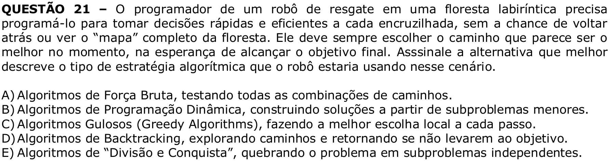

# Question 21

## English transcription of the question

A rescue robot programmer in a maze-like forest needs to program it to make quick and efficient decisions at each crossroads, without the chance to go back or see the complete “map” of the forest. It must always choose the path that seems to be the best at the moment, in the hope of reaching the final goal. Select the alternative that best describes the type of algorithmic strategy the robot would be using in this scenario.

A) Brute-force algorithms, testing all combinations of paths.  
B) Dynamic programming algorithms, building solutions from smaller subproblems.  
C) Greedy algorithms, making the best local choice at each step.  
D) Backtracking algorithms, exploring paths and returning if they do not lead to the goal.  
E) Divide-and-conquer algorithms, breaking the problem into independent subproblems.

## Prompt

Answer the question(s) in this image by explaining step by step the reasoning used to answer it/them. Inform if any question is unclear or does not have a possible answer.
