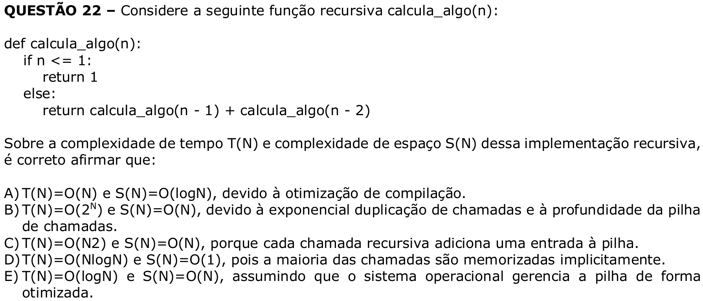

# Question 22



## English transcription of the question

Consider the following recursive function `calcula_algo(n)`:

```python
def calcula_algo(n):
    if n <= 1:
        return 1
    else:
        return calcula_algo(n - 1) + calcula_algo(n - 2)
```

Regarding the time complexity T(N) and space complexity S(N) of this recursive implementation, it is correct to state that:

A) T(N)=O(N) and S(N)=O(logN), due to compiler optimization.  
B) T(N)=O(2^N) and S(N)=O(N), due to the exponential duplication of calls and the depth of the call stack.  
C) T(N)=O(N2) and S(N)=O(N), because each recursive call adds an entry to the stack.  
D) T(N)=O(NlogN) and S(N)=O(1), because most calls are implicitly memoized.  
E) T(N)=O(logN) and S(N)=O(N), assuming that the operating system manages the stack in an optimized way.

## Prompt

Answer the question(s) in this image by explaining step by step the reasoning used to answer it/them. Inform if any question is unclear or does not have a possible answer.
