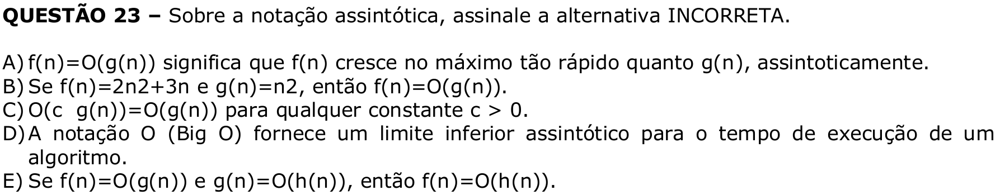

# Question 23

## English transcription of the question

Regarding asymptotic notation, select the INCORRECT alternative.

A) f(n)=O(g(n)) means that f(n) grows at most as fast as g(n), asymptotically.  
B) If f(n)=2n2+3n and g(n)=n2, then f(n)=O(g(n)).  
C) O(c g(n))=O(g(n)) for any constant c > 0.  
D) The O notation (Big O) provides an asymptotic lower bound for the execution time of an algorithm.  
E) If f(n)=O(g(n)) and g(n)=O(h(n)), then f(n)=O(h(n)).

## Prompt

Answer the question(s) in this image by explaining step by step the reasoning used to answer it/them. Inform if any question is unclear or does not have a possible answer.
