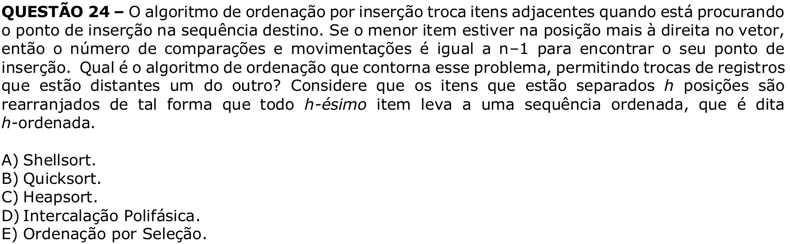

# Question 24

## English transcription of the question

The insertion sort algorithm exchanges adjacent items while it is looking for the insertion point in the destination sequence. If the smallest item is in the rightmost position of the array, then the number of comparisons and movements is equal to n−1 to find its insertion point. Which sorting algorithm avoids this problem by allowing records that are far apart from each other to be exchanged? Consider that items separated by h positions are rearranged in such a way that every h-th item forms an ordered sequence, called h-sorted.

A) Shellsort.  
B) Quicksort.  
C) Heapsort.  
D) Polyphase merge.  
E) Selection sort.

## Prompt

Answer the question(s) in this image by explaining step by step the reasoning used to answer it/them. Inform if any question is unclear or does not have a possible answer.
