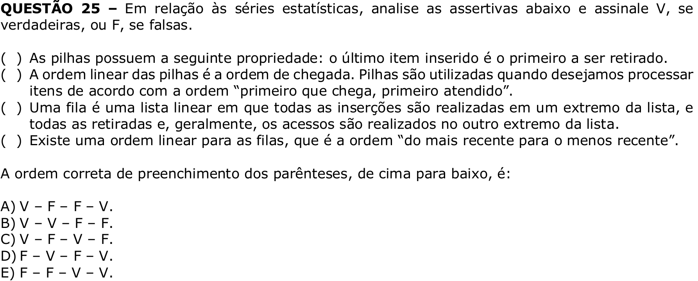

# Question 25

## English transcription of the question

Regarding statistical series, analyze the assertions below and mark V if they are true or F if they are false.

( ) Stacks have the following property: the last item inserted is the first to be removed.  
( ) The linear order of stacks is the order of arrival. Stacks are used when we want to process items according to the order “first come, first served”.  
( ) A queue is a linear list in which all insertions are performed at one end of the list, and all removals and, generally, accesses are performed at the other end of the list.  
( ) There is a linear order for queues, which is the order “from the most recent to the least recent”.

The correct order for filling in the parentheses, from top to bottom, is:

A) V – F – F – V.  
B) V – V – F – F.  
C) V – F – V – F.  
D) F – V – F – V.  
E) F – F – V – V.

## Prompt

Answer the question(s) in this image by explaining step by step the reasoning used to answer it/them. Inform if any question is unclear or does not have a possible answer.
