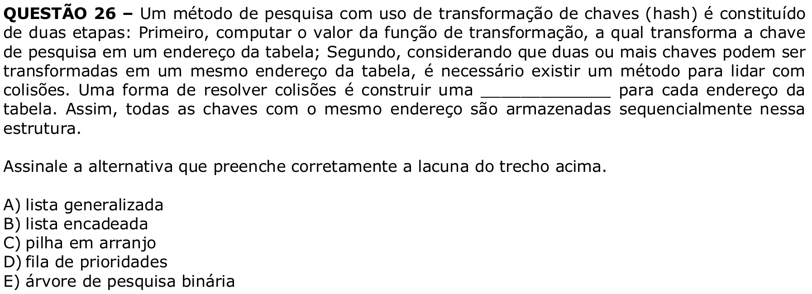

# Question 26

## English transcription of the question

A search method using key transformation (hashing) consists of two stages: first, computing the value of the transformation function, which transforms the search key into an address in the table; second, considering that two or more keys may be transformed into the same address in the table, it is necessary to have a method to deal with collisions. One way to resolve collisions is to build a __________ for each address in the table. Thus, all keys with the same address are stored sequentially in this structure.

Select the alternative that correctly fills in the blank in the passage above.

A) generalized list  
B) linked list  
C) array stack  
D) priority queue  
E) binary search tree

## Prompt

Answer the question(s) in this image by explaining step by step the reasoning used to answer it/them. Inform if any question is unclear or does not have a possible answer.
