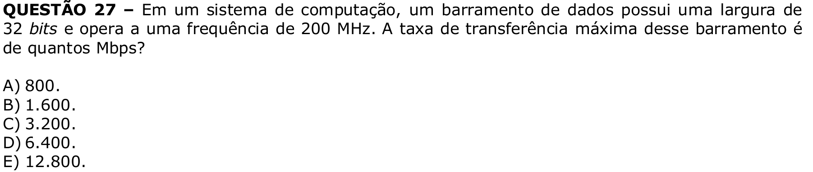

# Question 27

## English transcription of the question

In a computing system, a data bus has a width of 32 bits and operates at a frequency of 200 MHz. What is the maximum transfer rate of this bus in Mbps?

A) 800.  
B) 1,600.  
C) 3,200.  
D) 6,400.  
E) 12,800.

## Prompt

Answer the question(s) in this image by explaining step by step the reasoning used to answer it/them. Inform if any question is unclear or does not have a possible answer.
