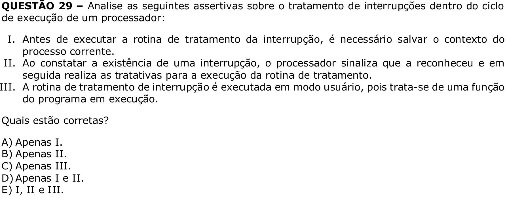

# Question 29

## English transcription of the question

Analyze the following assertions about interrupt handling within the execution cycle of a processor:

I. Before executing the interrupt handling routine, it is necessary to save the context of the current process.  
II. Upon detecting the existence of an interrupt, the processor signals that it has recognized it and then performs the procedures for executing the handling routine.  
III. The interrupt handling routine is executed in user mode, because it is a function of the program being executed.

Which assertions are correct?

A) I only.  
B) II only.  
C) III only.  
D) I and II only.  
E) I, II and III.

## Prompt

Answer the question(s) in this image by explaining step by step the reasoning used to answer it/them. Inform if any question is unclear or does not have a possible answer.
