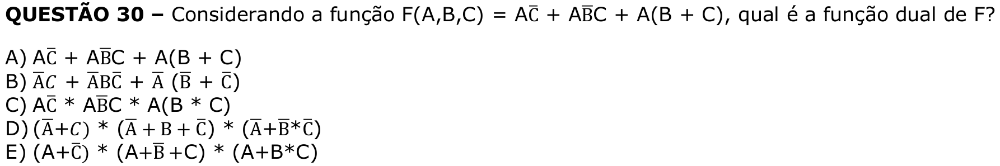

# Question 30

## English transcription of the question

Considering the function F(A,B,C) = A C̄ + A B̄ C + A(B + C), what is the dual function of F?

A) A C̄ + A B̄ C + A(B + C)  
B) ĀC + ĀB C̄ + Ā(B̄ + C̄)  
C) A C̄ * A B̄ C * A(B * C)  
D) (Ā + C) * (Ā + B + C̄) * (Ā + B̄ * C̄)  
E) (A + C̄) * (A + B̄ + C) * (A + B * C)

## Prompt

Answer the question(s) in this image by explaining step by step the reasoning used to answer it/them. Inform if any question is unclear or does not have a possible answer.
