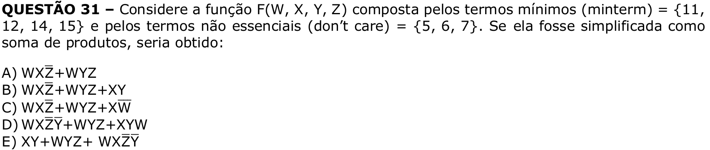

# Question 31

## English transcription of the question

Consider the function F(W, X, Y, Z) composed of the minterms = {11, 12, 14, 15} and the nonessential terms (don’t care) = {5, 6, 7}. If it were simplified as a sum of products, the result would be:

A) WXZ̄ + WYZ  
B) WXZ̄ + WYZ + XY  
C) WXZ̄ + WYZ + XW̄  
D) WXZ̄Ȳ + WYZ + XYW  
E) XY + WYZ + WXZ̄Ȳ

## Prompt

Answer the question(s) in this image by explaining step by step the reasoning used to answer it/them. Inform if any question is unclear or does not have a possible answer.
