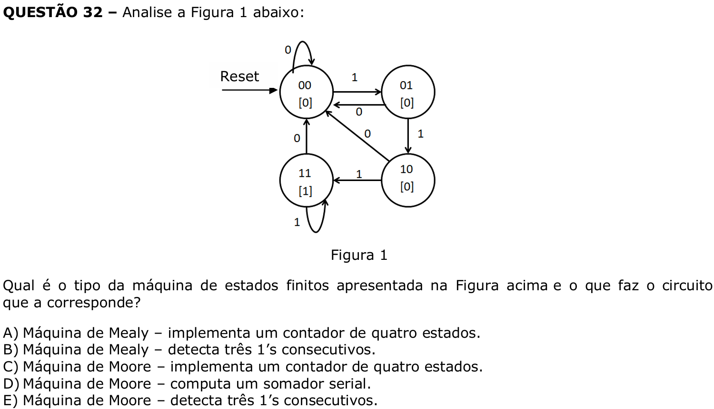

# Question 32

## English transcription of the question

Analyze Figure 1 below.

What is the type of finite-state machine shown in the figure above, and what does the corresponding circuit do?

A) Mealy machine – implements a four-state counter.  
B) Mealy machine – detects three consecutive 1s.  
C) Moore machine – implements a four-state counter.  
D) Moore machine – computes a serial adder.  
E) Moore machine – detects three consecutive 1s.

## Prompt

Answer the question(s) in this image by explaining step by step the reasoning used to answer it/them. Inform if any question is unclear or does not have a possible answer.
