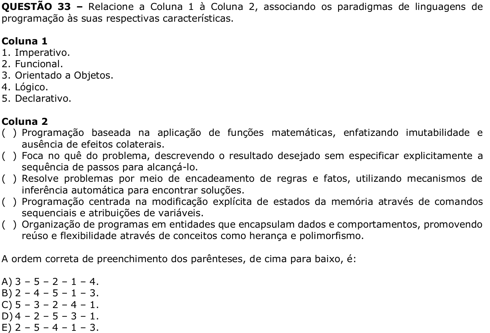

# Question 33

## English transcription of the question

Relate Column 1 to Column 2, associating programming language paradigms with their respective characteristics.

Column 1

1. Imperative.  
2. Functional.  
3. Object-Oriented.  
4. Logical.  
5. Declarative.

Column 2

( ) Programming based on the application of mathematical functions, emphasizing immutability and absence of side effects.  
( ) Focuses on the “what” of the problem, describing the desired result without explicitly specifying the sequence of steps to achieve it.  
( ) Solves problems through chains of rules and facts, using automatic inference mechanisms to find solutions.  
( ) Programming centered on the explicit modification of memory states through sequential commands and variable assignments.  
( ) Organization of programs into entities that encapsulate data and behaviors, promoting reuse and flexibility through concepts such as inheritance and polymorphism.

The correct order for filling in the parentheses, from top to bottom, is:

A) 3 – 5 – 2 – 1 – 4.  
B) 2 – 4 – 5 – 1 – 3.  
C) 5 – 3 – 2 – 4 – 1.  
D) 4 – 2 – 5 – 3 – 1.  
E) 2 – 5 – 4 – 1 – 3.

## Prompt

Answer the question(s) in this image by explaining step by step the reasoning used to answer it/them. Inform if any question is unclear or does not have a possible answer.
