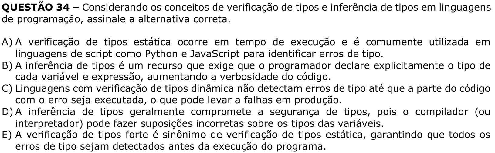

# Question 34

## English transcription of the question

Considering the concepts of type checking and type inference in programming languages, select the correct alternative.

A) Static type checking occurs at runtime and is commonly used in scripting languages such as Python and JavaScript to identify type errors.  
B) Type inference is a feature that requires the programmer to explicitly declare the type of every variable and expression, increasing code verbosity.  
C) Languages with dynamic type checking do not detect type errors until the part of the code with the error is executed, which may lead to failures in production.  
D) Type inference generally compromises type safety, because the compiler (or interpreter) may make incorrect assumptions about the types of variables.  
E) Strong type checking is synonymous with static type checking, ensuring that all type errors are detected before program execution.

## Prompt

Answer the question(s) in this image by explaining step by step the reasoning used to answer it/them. Inform if any question is unclear or does not have a possible answer.
