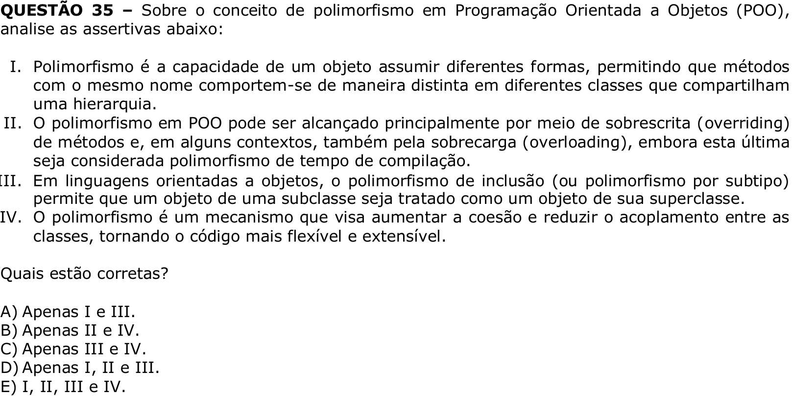

# Question 35

## English transcription of the question

Regarding the concept of polymorphism in Object-Oriented Programming (OOP), analyze the assertions below:

I. Polymorphism is the ability of an object to assume different forms, allowing methods with the same name to behave differently in different classes that share a hierarchy.  
II. Polymorphism in OOP can be achieved mainly through method overriding and, in some contexts, also through method overloading, although the latter is considered compile-time polymorphism.  
III. In object-oriented languages, inclusion polymorphism (or subtype polymorphism) allows an object of a subclass to be treated as an object of its superclass.  
IV. Polymorphism is a mechanism intended to increase cohesion and reduce coupling among classes, making the code more flexible and extensible.

Which assertions are correct?

A) I and III only.  
B) II and IV only.  
C) III and IV only.  
D) I, II and III only.  
E) I, II, III and IV.

## Prompt

Answer the question(s) in this image by explaining step by step the reasoning used to answer it/them. Inform if any question is unclear or does not have a possible answer.
