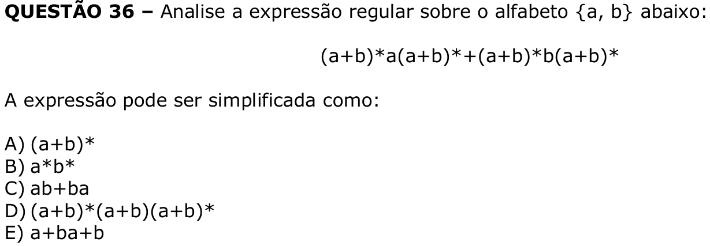

# Question 36

## English transcription of the question

Analyze the regular expression over the alphabet {a, b} below:

`(a+b)*a(a+b)* + (a+b)*b(a+b)*`

The expression can be simplified as:

A) `(a+b)*`  
B) `a*b*`  
C) `ab+ba`  
D) `(a+b)*(a+b)(a+b)*`  
E) `a+ba+b`

## Prompt

Answer the question(s) in this image by explaining step by step the reasoning used to answer it/them. Inform if any question is unclear or does not have a possible answer.
