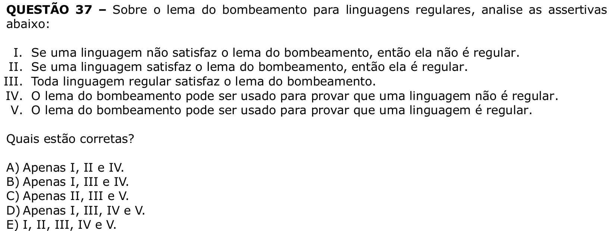

# Question 37

## English transcription of the question

Regarding the pumping lemma for regular languages, analyze the assertions below:

I. If a language does not satisfy the pumping lemma, then it is not regular.  
II. If a language satisfies the pumping lemma, then it is regular.  
III. Every regular language satisfies the pumping lemma.  
IV. The pumping lemma can be used to prove that a language is not regular.  
V. The pumping lemma can be used to prove that a language is regular.

Which assertions are correct?

A) I, II and IV only.  
B) I, III and IV only.  
C) II, III and V only.  
D) I, III, IV and V only.  
E) I, II, III, IV and V.

## Prompt

Answer the question(s) in this image by explaining step by step the reasoning used to answer it/them. Inform if any question is unclear or does not have a possible answer.
