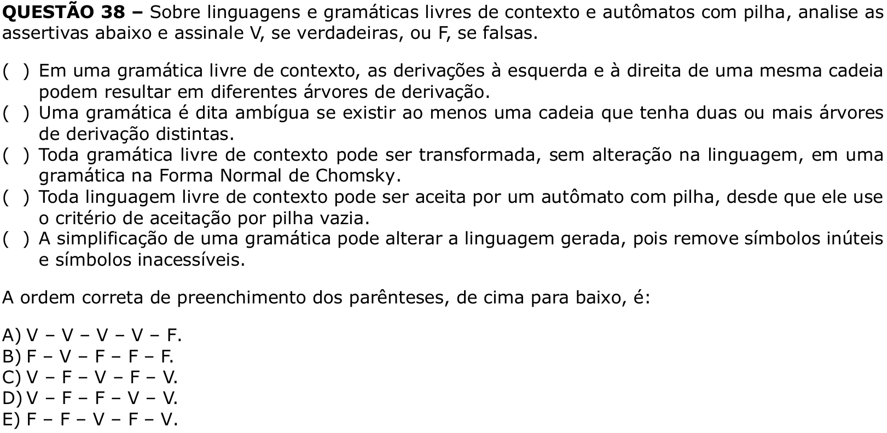

# Question 38

## English transcription of the question

Regarding context-free languages and grammars and pushdown automata, analyze the assertions below and mark V if they are true or F if they are false.

( ) In a context-free grammar, the leftmost and rightmost derivations of the same string may result in different derivation trees.  
( ) A grammar is said to be ambiguous if there is at least one string that has two or more distinct derivation trees.  
( ) Every context-free grammar can be transformed, without changing the language, into a grammar in Chomsky Normal Form.  
( ) Every context-free language can be accepted by a pushdown automaton, provided that it uses the acceptance criterion by empty stack.  
( ) Simplifying a grammar may change the generated language, because it removes useless and inaccessible symbols.

The correct order for filling in the parentheses, from top to bottom, is:

A) V – V – V – V – F.  
B) F – V – F – F – F.  
C) V – F – V – F – V.  
D) V – F – F – V – V.  
E) F – F – V – F – V.

## Prompt

Answer the question(s) in this image by explaining step by step the reasoning used to answer it/them. Inform if any question is unclear or does not have a possible answer.
