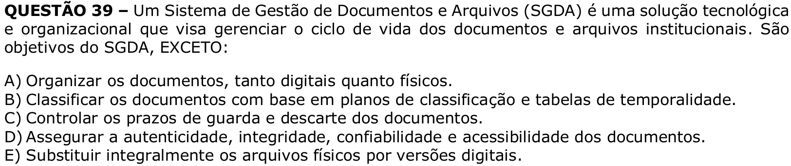

# Question 39

## English transcription of the question

A Document and Archive Management System (DAMS) is a technological and organizational solution that aims to manage the life cycle of institutional documents and archives. The following are objectives of a DAMS, EXCEPT:

A) Organize documents, both digital and physical.  
B) Classify documents based on classification plans and retention schedules.  
C) Control document retention and disposal deadlines.  
D) Ensure the authenticity, integrity, reliability and accessibility of documents.  
E) Completely replace physical archives with digital versions.

## Prompt

Answer the question(s) in this image by explaining step by step the reasoning used to answer it/them. Inform if any question is unclear or does not have a possible answer.
