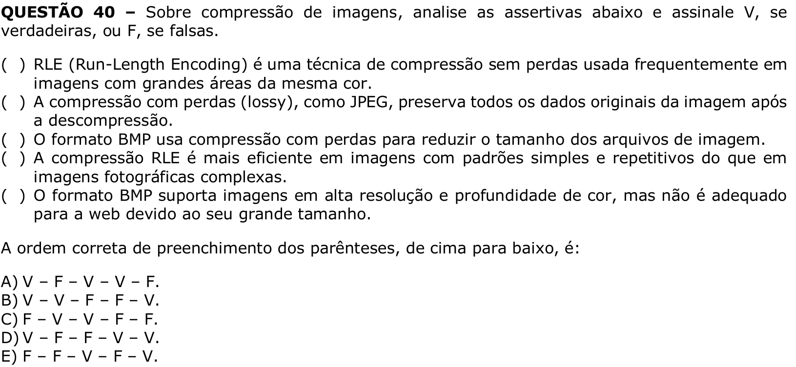

# Question 40

## English transcription of the question

Regarding image compression, analyze the assertions below and mark V if they are true or F if they are false.

( ) RLE (Run-Length Encoding) is a lossless compression technique frequently used in images with large areas of the same color.  
( ) Lossy compression, such as JPEG, preserves all original image data after decompression.  
( ) The BMP format uses lossy compression to reduce the size of image files.  
( ) RLE compression is more efficient in images with simple and repetitive patterns than in complex photographic images.  
( ) The BMP format supports images with high resolution and color depth, but it is not suitable for the web due to its large size.

The correct order for filling in the parentheses, from top to bottom, is:

A) V – F – V – V – F.  
B) V – V – F – F – V.  
C) F – V – V – F – F.  
D) V – F – F – V – V.  
E) F – F – V – F – V.

## Prompt

Answer the question(s) in this image by explaining step by step the reasoning used to answer it/them. Inform if any question is unclear or does not have a possible answer.
