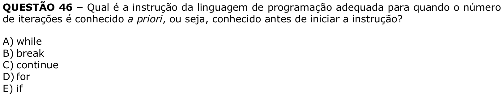

# Question 46

**English transcription of the question:** Which programming language instruction is appropriate when the number of iterations is known *a priori*, that is, known before starting the instruction?

A) while  
B) break  
C) continue  
D) for  
E) if

**Prompt:** Answer the question in this image by explaining step by step the reasoning used to answer it. Inform if the question is not clear or does not have a possible answer.
