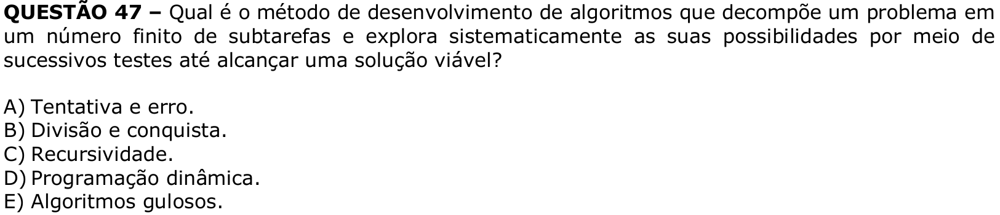

# Question 47

**English transcription of the question:** What algorithm development method decomposes a problem into a finite number of subtasks and systematically explores their possibilities through successive tests until it reaches a viable solution?

A) Trial and error.  
B) Divide and conquer.  
C) Recursion.  
D) Dynamic programming.  
E) Greedy algorithms.

**Prompt:** Answer the question in this image by explaining step by step the reasoning used to answer it. Inform if the question is not clear or does not have a possible answer.
