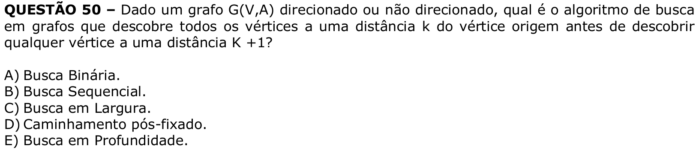

# Question 50

**English transcription of the question:** Given a graph G(V,A), directed or undirected, which graph search algorithm discovers all vertices at distance k from the source vertex before discovering any vertex at distance k + 1?

A) Binary search.  
B) Sequential search.  
C) Breadth-first search.  
D) Postorder traversal.  
E) Depth-first search.

**Prompt:** Answer the question in this image by explaining step by step the reasoning used to answer it. Inform if the question is not clear or does not have a possible answer.
