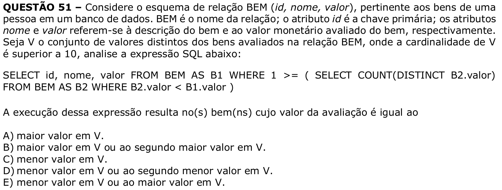

# Question 51



**English transcription of the question:** Consider the relation schema BEM (`id`, `nome`, `valor`), pertaining to a person’s assets in a database. BEM is the name of the relation; the attribute `id` is the primary key; the attributes `nome` and `valor` refer to the description of the asset and to the monetary appraised value of the asset, respectively. Let V be the set of distinct values of the appraised assets in the BEM relation, where the cardinality of V is greater than 10. Analyze the SQL expression below:

```sql
SELECT id, nome, valor
FROM BEM AS B1
WHERE 1 >= (
  SELECT COUNT(DISTINCT B2.valor)
  FROM BEM AS B2
  WHERE B2.valor < B1.valor
)
```

The execution of this expression results in the asset(s) whose appraised value is equal to:

A) the largest value in V.  
B) the largest value in V or the second largest value in V.  
C) the smallest value in V.  
D) the smallest value in V or the second smallest value in V.  
E) the smallest value in V or the largest value in V.

**Prompt:** Answer the question in this image by explaining step by step the reasoning used to answer it. Inform if the question is not clear or does not have a possible answer.
