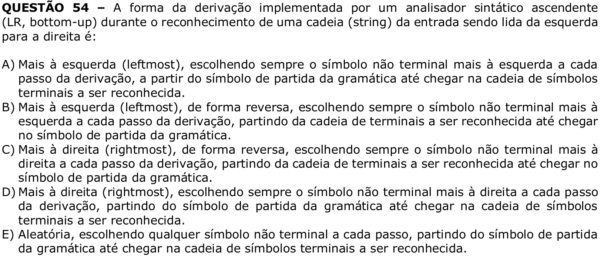

# Question 54

**English transcription of the question:** The form of derivation implemented by a bottom-up parser (LR, bottom-up) during the recognition of a string from the input being read from left to right is:

A) Leftmost, always choosing the leftmost nonterminal symbol at each derivation step, starting from the grammar’s start symbol until reaching the string of terminal symbols to be recognized.  
B) Leftmost, in reverse, always choosing the leftmost nonterminal symbol at each derivation step, starting from the string of terminals to be recognized until reaching the grammar’s start symbol.  
C) Rightmost, in reverse, always choosing the rightmost nonterminal symbol at each derivation step, starting from the string of terminals to be recognized until reaching the grammar’s start symbol.  
D) Rightmost, always choosing the rightmost nonterminal symbol at each derivation step, starting from the grammar’s start symbol until reaching the string of terminal symbols to be recognized.  
E) Random, choosing any nonterminal symbol at each step, starting from the grammar’s start symbol until reaching the string of terminal symbols to be recognized.

**Prompt:** Answer the question in this image by explaining step by step the reasoning used to answer it. Inform if the question is not clear or does not have a possible answer.
