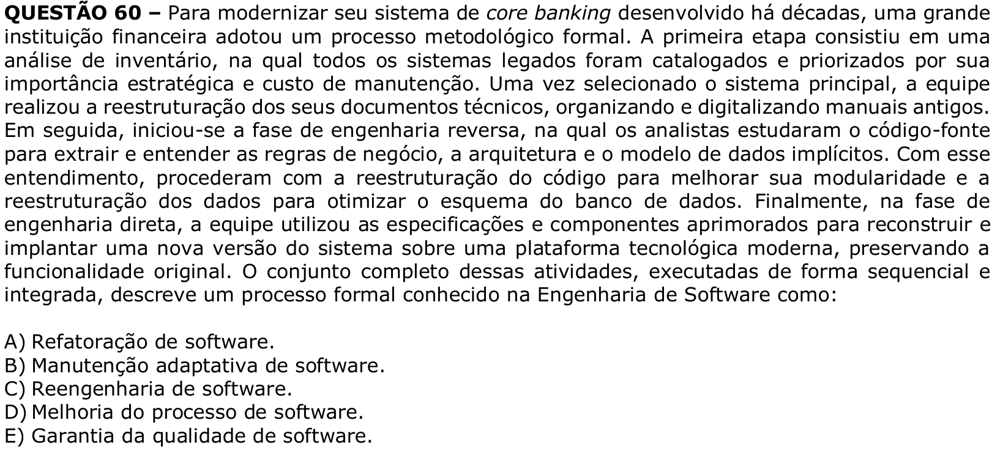

# Question 60

**English transcription of the question:** To modernize its core banking system developed decades ago, a large financial institution adopted a formal methodological process. The first stage consisted of an inventory analysis, in which all legacy systems were cataloged and prioritized according to their strategic importance and maintenance cost. Once the main system was selected, the team restructured its technical documents, organizing and digitizing old manuals. Next, the reverse engineering phase began, in which analysts studied the source code to extract and understand the business rules, architecture, and implicit data model. With this understanding, they proceeded with code restructuring to improve modularity and data restructuring to optimize the database schema. Finally, in the forward engineering phase, the team used the improved specifications and components to rebuild and deploy a new version of the system on a modern technological platform, preserving the original functionality. The complete set of these activities, executed sequentially and in an integrated manner, describes a formal process known in Software Engineering as:

A) Software refactoring.  
B) Adaptive software maintenance.  
C) Software reengineering.  
D) Software process improvement.  
E) Software quality assurance.

**Prompt:** Answer the question in this image by explaining step by step the reasoning used to answer it. Inform if the question is not clear or does not have a possible answer.
