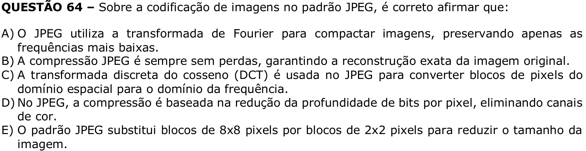

# Question 64

## English transcription of the question

QUESTION 64 – Regarding image coding in the JPEG standard, it is correct to state that:

A) JPEG uses the Fourier transform to compress images, preserving only the lowest frequencies.  
B) JPEG compression is always lossless, ensuring exact reconstruction of the original image.  
C) The discrete cosine transform (DCT) is used in JPEG to convert blocks of pixels from the spatial domain to the frequency domain.  
D) In JPEG, compression is based on reducing the bit depth per pixel, eliminating color channels.  
E) The JPEG standard replaces 8x8-pixel blocks with 2x2-pixel blocks to reduce image size.

## Prompt

Prompt: Answer the question(s) in this image by explaining step by step the reasoning used to answer it (them). Inform if any question is not clear or does not have a possible answer.
