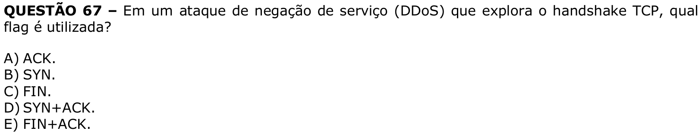

# Question 67

## English transcription of the question

QUESTION 67 – In a denial-of-service (DDoS) attack that exploits the TCP handshake, which flag is used?

A) ACK.  
B) SYN.  
C) FIN.  
D) SYN+ACK.  
E) FIN+ACK.

## Prompt

Prompt: Answer the question(s) in this image by explaining step by step the reasoning used to answer it (them). Inform if any question is not clear or does not have a possible answer.
