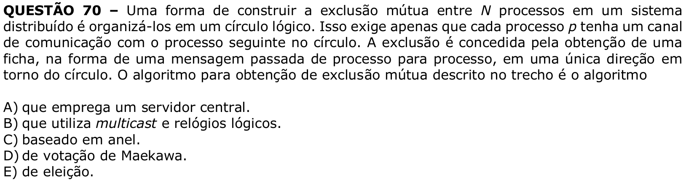

# Question 70

## English transcription of the question

QUESTION 70 – One way to build mutual exclusion among N processes in a distributed system is to organize them in a logical circle. This only requires that each process p have a communication channel with the next process in the circle. Exclusion is granted by obtaining a token, in the form of a message passed from process to process, in a single direction around the circle. The algorithm for obtaining mutual exclusion described in the passage is the algorithm

A) that employs a central server.  
B) that uses multicast and logical clocks.  
C) based on a ring.  
D) Maekawa's voting algorithm.  
E) election algorithm.

## Prompt

Prompt: Answer the question(s) in this image by explaining step by step the reasoning used to answer it (them). Inform if any question is not clear or does not have a possible answer.
